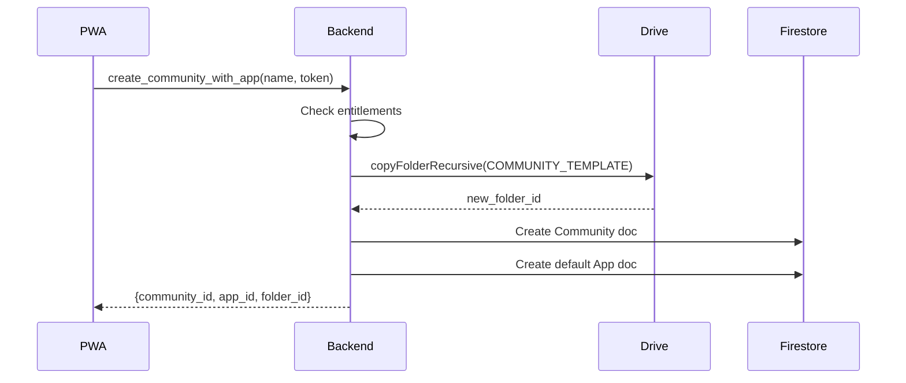
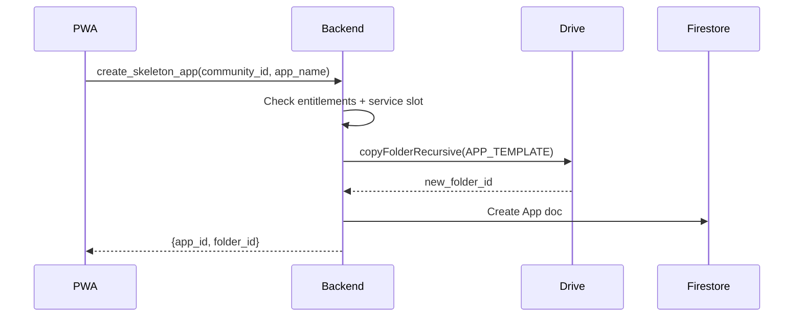

# App Creation Guide

**Status:** Implemented  
**Version:** 2.0  
**Last Updated:** January 2026

This document describes how apps and communities are created and hydrated in the DeSciX platform.

---

## 1. Core Philosophy

**"PWA for Provisioning, CLI for Development"**

- **Provisioning:** All apps and communities are created through the PWA. This enforces entitlement checks (NFTs, subscriptions) and ensures consistent folder structures via Drive templates.
- **Development:** The CLI is the primary tool for hydrating the local workspace, managing content, and syncing to the cloud. The CLI does not create apps directly.

**Important Distinction:**

| Mode | Users | Tool | Content Management |
|------|-------|------|-------------------|
| **Drive Mode** | Non-developers | PWA only | Server-side pipeline (Drive → GCS → Pinecone) |
| **Git Mode** | Developers | CLI | Local processing (Drive pull → Git → Pinecone) |

All apps start on Drive (users create documents there). Git-mode applies when developers pull content locally and use Git for version control of text/chunks. The CLI **only supports git-mode** operations.

---

## 2. Two-Tier Template Architecture

### Why Two Tiers?

DeSciX uses a **two-tier template system** that separates content from code:

1. **Drive Templates** - Content (assets, KB docs) synced to/from Google Drive
2. **Git Scaffolds** - Code (site, microservice) that lives in Git

This separation ensures:
- Content stays editable in Drive (non-developers can update)
- Code stays version-controlled in Git
- Clear deployment paths for each type
- No code in Drive, no content in Git scaffolds

### Drive Templates

**Location:** Google Drive, owned by `dip@descix.net`  
**SDK Reference:** `DeSciX_Core/descix-cli/templates/drive/`  
**Template IDs:** Configured in `DeSciX_Cloud/microservice/defaults-config.json`

```json
{
  "DRIVE_COMMUNITY_TEMPLATE_FOLDER_ID": "1ABC...",
  "DRIVE_AGENT_APP_TEMPLATE_FOLDER_ID": "1XYZ..."
}
```

**Community Template:**
```
templates/drive/community/
├── community_assets/
│   ├── icon.png                    # Community icon (512x512)
│   └── community_description.md    # Community description
└── Apps/                           # Empty, ready for apps
```

**App Template:**
```
templates/drive/app/
├── assets/
│   ├── app_description.md         # App store listing
│   ├── system_instructions.md     # AI persona instructions
│   └── icon.png                    # App icon (512x512)
└── kb/
    └── General/
        └── README.md               # KB starter doc
```

**Note:** The Drive template does NOT include `site/` or `microservice/` folders. Code scaffolds are added separately via CLI.

### Git Scaffolds

**Location:** microservice — `DeSciX_Core/descix-cli/templates/scaffolds/`;
site — `DeSciX_Core/descix-app-sdk/scaffold/` (owned there, and exported as `SITE_SCAFFOLD_DIR`
from `@descix/app-sdk/scaffold`, so no caller re-derives the path).

**Site Scaffold:**
```
descix-app-sdk/scaffold/site/
├── index.html        # Entry point
├── styles.css        # Basic styling
├── app.js            # Client-side JavaScript
├── DeSciXAppSDK.js   # The DeSciX bridge — GENERATED, do not hand-edit
└── README.md         # Usage instructions
```

`DeSciXAppSDK.js` ships IN the scaffold; it is not something you add afterwards. It is
generated from `descix-app-sdk/templates/DeSciXAppSDK.template.js` (which inlines
`descix-app-sdk/src/util/bridgeResolver.js`, the one owner of frame-level detection) and a
`--check` drift gate keeps the copies identical. Patch the template and regenerate — never
the copy.

**Microservice Scaffold:**
```
templates/scaffolds/microservice/
├── app.js                      # Entry point — binds the server, mounts the router
├── package.json
├── Dockerfile
├── app.yaml
├── manifest.json
├── defaults-config.json        # Layered config: committed defaults
├── defaults-config-dev.json
├── setup-schema.json
├── SERVICE_README_sdk.md
├── scripts/
│   └── register.js             # Registers the service MANIFEST (commands) for discovery
├── services/
│   ├── utils.js                # Config bootstrap over @descix/cloud-core — read first
│   ├── apiFront.js
│   ├── mcpClient.js
│   └── commandHandlers/
└── templates/
    └── SERVICE_README_TEMPLATE.md
```

There is no `src/` directory. The entry point is `app.js` at the root and the service code
lives under `services/`. See `guides/microservice-pattern.md` for why `services/utils.js` is
the file to open first.

### Adding Scaffolds to Apps

After an app is created via PWA, add code scaffolds via CLI:

```bash
# Add site scaffold
descix site init

# Add microservice scaffold
descix microservice init
```

---

## 3. Creation Flows

### 3.1 Community Creation

**Trigger:** User creates community via PWA  
**Backend Endpoint:** `create_community_with_app`

**Flow:**


**Backend Implementation:**
```javascript
// communityManagement.js
async function create_community_with_app(params) {
  // 1. Copy community template
  const communityFolderId = await copyFolderRecursive(
    DRIVE_COMMUNITY_TEMPLATE_FOLDER_ID,
    userBaseFolderId,
    params.name
  );
  
  // 2. Copy app template into community
  const appFolderId = await copyFolderRecursive(
    DRIVE_AGENT_APP_TEMPLATE_FOLDER_ID,
    communityFolderId + '/Apps',
    params.app_name
  );
  
  // 3. Create Firestore records
  await createCommunityDoc(communityId, communityFolderId);
  await createAppDoc(appId, appFolderId);
  
  return { community_id, app_id };
}
```

### 3.2 App Creation

**Trigger:** User creates app via PWA (within existing community)  
**Backend Endpoint:** `create_skeleton_app`

**Flow:**


---

## 4. Workspace Builder

The PWA Workspace Builder allows users to configure which apps to sync to their local workspace.

### Flow

1. User completes device login (`descix login --setup`)
2. PWA opens with Workspace Builder
3. User selects/creates apps to include
4. PWA returns `workspace_config` to CLI
5. CLI hydrates local folders

### Workspace Config Response

```json
{
  "workspace_config": {
    "communities": {
      "descix": {
        "apps": {
          "agent": {
            "localPath": "descix/agent",
            "sync_mode": "git"
          }
        }
      }
    }
  },
  "drive_config": {
    "base_folder_id": "1ABC..."
  }
}
```

---

## 5. CLI Hydration

### Setup Command

```bash
descix mcp quickstart [--dev]
```

**Flow:**
1. Check prerequisites (gcloud CLI, ADC)
2. Verify Drive access
3. Open browser for device login
4. Receive workspace config from PWA
5. Call `Hydrator.hydrateWorkspace()`
6. Create local folder structure
7. Pull content from Drive

### Hydration Process

The `Hydrator` module handles all folder creation and content sync:

```javascript
// Hydrator.hydrateWorkspace() creates:
[workspace]/
├── .descix/
│   └── workspace.json       # Workspace configuration (sole config file)
├── [community]/[app]/
│   ├── assets/
│   ├── kb/
│   │   ├── staging/         # For local files to push to Drive
│   │   ├── General/         # Converted text from Drive
│   │   └── chunks/          # Generated chunk files
│   ├── site/                # Optional: for CodeSite
│   └── microservice/        # Optional: for backend service
└── .gitignore               # Updated with .descix/wallet.json
```

**Note:** App configuration is stored in `workspace.json`, not in per-app `context.json` files. The CLI auto-detects app context based on the current working directory.

### Hydrating Individual Apps

After initial setup, users can hydrate specific apps:

```bash
# Pull entire app from Drive
descix drive pull -c community -a app

# Or use the build command for full pipeline
descix kb corpus sync
```

---

## 6. Folder Structure Standards

### App Folders

| Folder | Purpose | Sync Direction |
|--------|---------|----------------|
| `assets/` | App metadata (icon, description) | Bidirectional |
| `kb/staging/` | Local files to push to Drive | Local → Drive |
| `kb/General/` | Text-converted files from Drive | Drive → Local |
| `kb/chunks/` | JSON chunks for Pinecone | Local only |
| `site/` | Static site files | Local → GCS |
| `microservice/` | Service code | Local → GCS |

### Required Files

**`assets/` folder:**
- `icon.png` - App icon (square, PNG, 512x512 recommended)
- `app_description.md` - Markdown description for App Store
- `system_instructions.md` - AI agent persona and instructions

**`kb/General/` folder:**
- Contains reference documents for RAG
- All formats converted to Markdown/text

---

## 7. Entitlement Checks

App creation requires appropriate entitlements:

| Resource | Entitlement Required |
|----------|---------------------|
| Community | Community Creation NFT or Subscription |
| App | Service Slot (Runner NFT/Subscription) |
| KB Storage | Included with app |
| Pinecone Vectors | Metered by plan |

The PWA and backend enforce these checks before template copying.

---

## 8. Key Backend Functions

### Template Copying

```javascript
// googleStorageService.js
async function copyFolderRecursive(sourceFolderId, destParentId, newName) {
  // Recursively copies folder structure
  // Maintains all files and subfolders
  // Returns new folder ID
}
```

### Creation Endpoints

| Endpoint | Description |
|----------|-------------|
| `create_community_with_app` | Create community + default app + token |
| `create_skeleton_app` | Create app from template in existing community |
| `create_kb_subfolder` | Add KB subfolder to existing app |

---

## 9. CLI Commands

### App Management (via PWA)

The CLI does not create apps directly. Users should:

1. Go to PWA dashboard
2. Create app/community
3. Run `descix mcp quickstart` or `descix login --setup` to hydrate

### Post-Creation Commands

```bash
# After app is created via PWA:
descix mcp quickstart --dev            # Hydrate workspace (first time)
descix kb corpus sync               # Pull, chunk, sync KB
descix site upload -a app   # Deploy static site
```

---

## 10. File References

| Component | Path | Description |
|-----------|------|-------------|
| Community Management | `DeSciX_Cloud/microservice/services/communityManagement.js` | Community/App creation |
| App Commands | `DeSciX_Cloud/microservice/services/commandHandlers/appCommands.js` | Server-side app ops |
| Google Storage Service | `DeSciX_Cloud/microservice/services/googleStorageService.js` | Drive/GCS operations |
| Template Config | `DeSciX_Cloud/microservice/defaults-config.json` | Template folder IDs |
| Drive Templates | `DeSciX_Core/descix-cli/templates/drive/` | Content templates |
| Git Scaffolds | `DeSciX_Core/descix-cli/templates/scaffolds/` | Code scaffolds |
| Hydrator | `DeSciX_Core/descix-cli/lib/core/Hydrator.js` | Workspace hydration |
| WorkspaceConfig | `DeSciX_Core/descix-cli/lib/workspace-config.js` | CLI configuration |
| Setup Command | `DeSciX_Core/descix-cli/lib/wizard/setup.js` | Initial setup |
| Scaffold Command | `DeSciX_Core/descix-cli/bin/descix.js` | CLI scaffolds |
