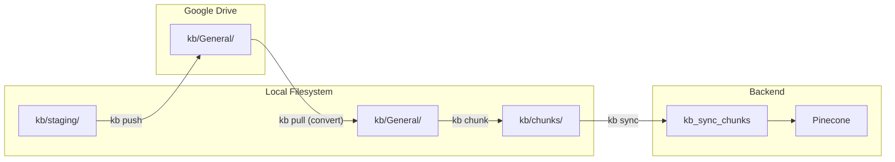

# SDK Architecture Reference

**Status:** Implemented  
**Version:** 2.0  
**Last Updated:** January 2026

This document is the canonical reference for the DeSciX SDK architecture, covering the CLI-centric KB processing pipeline, Drive synchronization, and folder structure conventions.

---

## 1. Architecture Overview

### Core Philosophy

1. **Drive as Backend:** Google Drive is the canonical source for raw assets (PDFs, documents, images).
2. **Git as Truth:** The local Git repository is the canonical source for *processed* text and code.
3. **Client-Side Mediation:** The CLI communicates directly with Drive via ADC (Application Default Credentials), removing server-side proxy overhead for file transfers.
4. **No Local Tools:** The CLI relies on Drive's internal conversion capabilities (OCR, Doc-to-Markdown) instead of bundling heavy local dependencies.

### Data Flow Summary

```
Drive (raw assets) → CLI (pull + convert) → Local Git (text + chunks) → Backend API → Pinecone
```

---

## 2. Core Components

All core SDK logic resides in `DeSciX_Core/descix-cli/lib/core/`.

### 2.1 Hydrator (`Hydrator.js`)

**Responsibilities:**
- Pull content from Drive to local filesystem
- Push staging files to Drive
- Convert files using Drive's native capabilities (PDF/Image → Google Doc → Markdown)
- Conflict detection and resolution during hydration

**Key Functions:**

| Function | Description |
|----------|-------------|
| `copyScaffold(type, appPath, options)` | Copy the `site` or `microservice` scaffold into an app (`descix site init` / `descix microservice init`) |
| `hydrateApp(config, options)` | Pull entire app from Drive |
| `hydrateKb(config, options)` | Pull and convert KB files from Drive |
| `pushStaging(config, options)` | Upload files from `kb/staging/` to Drive |
| `convertAndSave(driveFile, localDir)` | Convert and save a single file |

**Drive-Native Conversion Logic:**
1. PDF/DOCX/Images: Copy with `convert=true` → Creates temp Google Doc → Export as Markdown → Delete temp doc
2. Google Docs: Export directly as `text/markdown`
3. Google Sheets: Export as `text/csv`
4. Plain text files: Download as-is

### 2.2 Chunker (`Chunker.js`)

**Responsibilities:**
- Chunk documents for RAG embedding
- Support multiple chunking strategies (semantic, sliding window)
- Generate chunk records with metadata for Pinecone

**Key Functions:**

| Function | Description |
|----------|-------------|
| `categorizeFile(fileName, mimeType)` | Detect file type (code/docs/papers/generic) |
| `chunkFile(fileInfo, options)` | Chunk a file based on its type |
| `chunkDocument(content, metadata, rules)` | Markdown-aware section-based chunking |
| `processKb(config, options)` | Process entire KB directory into chunks |
| `loadChunks(config)` | Load all chunks from JSON files |

**Chunking Parameters (defaults):**
- `maxChunkSize`: 2000 characters
- `maxCodeFileSize`: 8000 characters
- `overlapSize`: 500 characters

**Chunking Strategies:**
- **Documents:** Split by Markdown headers (`#`, `##`, `###`) with overlap
- **Code:** Split by logical boundaries (functions, classes, contracts)
- **Generic:** Sliding window with overlap

### 2.3 Syncer (`Syncer.js`)

**Responsibilities:**
- Sync local chunks to Pinecone via backend API
- Compute delta between local and remote chunks
- Manage chunk lifecycle (upsert/delete)

**Key Functions:**

| Function | Description |
|----------|-------------|
| `syncKb(apiClient, config, options)` | Full sync workflow (delta + upsert + delete) |
| `computeChunkDelta(localChunks, remoteIds)` | Compare local vs remote chunks |
| `getRemoteChunkIds(apiClient, communityId, appId, kbId)` | Get existing chunk IDs from Pinecone |
| `upsertChunks(apiClient, ...)` | Push chunks to backend |
| `deleteStaleChunks(apiClient, ...)` | Remove deleted chunks |
| `getSyncStatus(apiClient, config)` | Check sync state |

**Security Note:** The CLI never communicates with Pinecone directly. All chunk operations go through the backend API, which validates metadata and manages Pinecone credentials.

---

## 3. Folder Structure

### Local App Structure

```
[app]/
├── assets/                     # App metadata (bidirectional sync)
│   ├── icon.png
│   ├── app_description.md
│   └── system_instructions.md
├── kb/
│   ├── staging/                # Local files to push to Drive
│   │   └── research.pdf
│   ├── General/                # Text-converted mirror of Drive
│   │   ├── research.md         # Converted from PDF
│   │   └── notes.md            # Converted from Google Doc
│   └── chunks/                 # Processed JSON chunks (Git-tracked)
│       ├── research.chunks.json
│       └── notes.chunks.json
├── site/                       # Static site files (push-only)
│   ├── index.html
│   └── DeSciXAppSDK.js         # The DeSciX bridge (generated)
└── microservice/               # Service code (push-only)
    ├── app.js                  # Entry point
    └── services/               # Service code — there is no src/
```

### Folder Purposes

| Folder | Sync Direction | Purpose |
|--------|----------------|---------|
| `assets/` | Bidirectional | App metadata (icon, description, instructions) |
| `kb/staging/` | Local → Drive | Raw files waiting to be pushed |
| `kb/General/` | Drive → Local | Text-converted files from Drive |
| `kb/chunks/` | Local only | JSON chunk files for Pinecone sync |
| `site/` | Local → GCS | Static site deployment |
| `microservice/` | Local → GCS | Backend service deployment |

### Configuration Files

**`.descix/workspace.json`** - The **sole** configuration file for CLI operations:

```json
{
  "version": "2.1",
  "type": "workspace",
  "workspaceRoot": "/path/to/workspace",
  "env": {
    "environment": "DEV",
    "apiUrl": "https://dev.descix.net",
    "gateway": { "port": 5599 },
    "products": [
      {
        "appId": "daita-agent",
        "communityId": "daita",
        "localPath": "daita/agent",
        "kbId": "General",
        "site": { "port": 3000 },
        "microservice": { "port": 4001 }
      }
    ]
  },
  "driveConfig": { "base_folder_id": "1ABC..." }
}
```

Every key is written by a CLI verb (`descix config init --env …`, `descix app init`, `descix app set-site`, `descix app set-port`, …) — see `workspace-config.md` for the key → verb table. A `communities` block without `env` (the v1 shape) is refused on load.

**Note:** `.descix.app/context.json` files are no longer used. All app configuration is stored in `workspace.json`. The CLI auto-detects app context from the current working directory by matching against registered app paths.

---

## 4. CLI Commands

The DeSciX CLI publishes content with one verb per plane. Each command resolves app context from `workspace.json` based on the current working directory, or takes `-a <app_id>` explicitly.

### 4.1 Publish Commands

| Command | Description |
|---------|-------------|
| `descix app sync-assets` | Sync app assets (`system_instructions.md`, `app_description.md`, `icon.png`) to the platform |
| `descix kb corpus sync` | Sync a knowledge base from the git files its manifest names to Pinecone |
| `descix site upload` | Deploy the site to GCS and record its path on the app |

### 4.2 KB Commands (`descix kb`, `descix drive`)

| Command | Description |
|---------|-------------|
| `descix app init -a <app_id> --kb <kb_name>` | Create a knowledge base on the app |
| `descix kb corpus sync` | Sync the manifest's git files to Pinecone |
| `descix kb corpus status` | Show corpus sync state (files, chunks, last sync, resolved ref) |
| `descix kb list` | List knowledge bases for an app |
| `descix kb delete` | Delete a knowledge base (refuses a non-empty KB unless `--force`) |
| `descix drive pull` | Pull content from Drive and convert to local markdown |
| `descix drive push` | Push staging files to Drive |

### Scaffold Commands

| Command | Description |
|---------|-------------|
| `descix site init` | Copy site template to current app's `site/` folder |
| `descix site upload` | Deploy site to GCS |
| `descix app set-site -a <app_id> --port <port>` | Register the local dev-server port for the app's site (`env.products[].site.port`) |
| `descix microservice init` | Copy microservice template to current app's `microservice/` folder |
| `descix microservice register` | Register microservice with gateway |
| `descix microservice vectorize` | Vectorize README for discovery |

**Note:** Site and microservice commands are Git-based code operations. Drive templates contain content (assets, KB), while site/microservice commands handle code (HTML, JS, Dockerfile, etc.).

### Common Options

| Option | Description |
|--------|-------------|
| `-c, --community <id>` | Community ID (inferred if single) |
| `-a, --app <id>` | App ID (inferred if single) |
| `-k, --kb <id>` | KB name (default: General) |
| `-v, --verbose` | Show detailed output |

### Setup Command

```bash
descix quickstart
```

Flow:
1. Device login in the browser (skipped when `.descix/wallet.json` holds a valid session)
2. Create `.descix/workspace.json` (skipped when a workspace already exists up the tree)
3. Write agent instruction files (`CLAUDE.md`, `.github/copilot-instructions.md`, `.cursorrules`, `.clinerules`)
4. Write `.vscode/mcp.json` (skipped when the DeSciX extension handles MCP)
5. Copy the SDK agent assets to `.descix/sdk-assets/` (fails loud if the package's assets are missing)

---

## 5. Backend API

### KB Endpoints

| Endpoint | Method | Description |
|----------|--------|-------------|
| `kb_sync_chunks` | POST | Upsert chunks to Pinecone |
| `kb_get_chunk_ids` | GET | Get existing chunk IDs for delta |
| `kb_delete_chunks` | DELETE | Remove stale chunks |

### `kb_sync_chunks` Request

```json
{
  "community_id": "daita",
  "app_id": "agent",
  "kb_id": "General",
  "chunks": [
    {
      "id": "daita_agent_General_research_0",
      "text": "...",
      "entity_type": "CHUNK",
      "community_id": "daita",
      "app_id": "agent",
      "knowledgebase_name": "General",
      "file_id": "research.md",
      "chunk_id": "0"
    }
  ]
}
```

### Pinecone Integration

The platform uses **Pinecone Integrated Embeddings**:
- Vectorization happens inside Pinecone, not in the backend
- The CLI/backend sends text + metadata only
- Pinecone's `llama-text-embed-v2` model handles embedding
- No local embedding libraries required

**Backend Flow:**
```
CLI → kb_sync_chunks API → pineconeService.upsertChunkRecords() → Pinecone (embeds + stores)
```

---

## 6. Data Flows

### Push-Pull-Convert Cycle



### Detailed Flow

1. **Stage:** User adds `paper.pdf` to `kb/staging/`
2. **Push:** `descix drive push` uploads to Drive `kb/General/`
3. **Pull:** `descix drive pull` downloads and converts:
   - Sees `paper.pdf` in Drive
   - Copies with `convert=true` → temp Google Doc
   - Exports as Markdown → `kb/General/paper.md`
   - Deletes temp doc
4. **Chunk:** `descix kb corpus sync` processes `paper.md`:
   - Generates `kb/chunks/paper.chunks.json`
5. **Sync:** `descix kb corpus sync` pushes to backend:
   - Backend validates metadata
   - Forwards to Pinecone
   - Pinecone embeds and stores

---

## 7. Authentication

### ADC (Application Default Credentials)

The CLI uses Google Cloud ADC for Drive access:

```bash
gcloud auth application-default login \
  --scopes=https://www.googleapis.com/auth/drive.file,https://www.googleapis.com/auth/drive
```

**Verification:**
- `Hydrator` calls `verifyDriveAuth()` before operations

### Backend Authentication

CLI authenticates to backend via device login:
1. `descix login` opens browser
2. User authenticates via Powch
3. CLI receives session token
4. Token stored in `.descix/wallet.json`

---

## 8. Migration Notes

### From `kb/src/` to `kb/staging/`

The v2 architecture renamed `kb/src/` to `kb/staging/` for clarity. The Hydrator includes automatic migration:

```javascript
// If old kb/src/ exists, rename to kb/staging/
const oldSrcDir = path.join(kbBaseDir, 'src');
if (await exists(oldSrcDir)) {
  await rename(oldSrcDir, stagingDir);
}
```

### Git Mode vs Drive Mode

Apps operate in one of two modes, determined by how they are managed:

| Mode | Source of Truth | Versioning | User Type | Tool |
|------|-----------------|------------|-----------|------|
| **git** | Local Git repo | Git | Developers | CLI (`descix kb *`) |
| **drive** | Google Drive | GCS/Firestore | Non-developers | PWA only |

**Important:** The CLI only supports **git-mode** operations. Drive-mode apps are managed entirely through the PWA with server-side processing. There is no CLI flag to switch modes - if you're using the CLI, you're in git-mode.

Both modes start with content on Google Drive (users create documents there). The difference is:
- **Git mode**: Developer pulls content from Drive, then manages text/chunks locally with Git
- **Drive mode**: PWA triggers server-side pipeline (Drive → GCS → Pinecone) automatically

---

## 9. File References

| Component | Path | Description |
|-----------|------|-------------|
| WorkspaceConfig | `DeSciX_Core/descix-cli/lib/workspace-config.js` | Sole configuration class |
| GlobalConfig | `DeSciX_Core/descix-cli/lib/global-config.js` | User-level settings (~/.descix) |
| Hydrator | `DeSciX_Core/descix-cli/lib/core/Hydrator.js` | Drive sync operations |
| Chunker | `DeSciX_Core/descix-cli/lib/core/Chunker.js` | KB chunking |
| Syncer | `DeSciX_Core/descix-cli/lib/core/Syncer.js` | Pinecone sync |
| KB Commands | `DeSciX_Core/descix-cli/lib/commands/kb.js` | Git-mode KB processing |
| Setup Command | `DeSciX_Core/descix-cli/lib/wizard/setup.js` | Initial workspace setup |
| Drive ADC | `DeSciX_Core/descix-cli/lib/google-storage-adc.js` | Google Drive API wrapper |
| Backend KB API | `DeSciX_Cloud/microservice/services/commandHandlers/appCommands.js` | Server-side processing |
| Pinecone Service | `DeSciX_Cloud/microservice/services/pineconeService.js` | Vector database |
| Server Chunking | `DeSciX_Cloud/microservice/services/chunkingUtils.js` | Drive-mode chunking |
